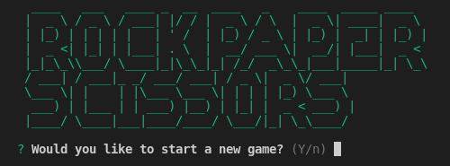
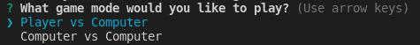
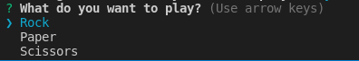
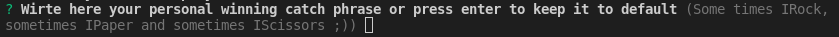
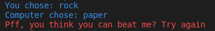

# ROCK PAPER SCISSORS CLI

Play rock-paper-scissors on your terminal against the computer, or watch the computer play against itself.

---

## Installation

- `npm install -g @shidoro/rock-paper-scissors-cli`

---

## Usage

- Type `rps` in your terminal
- follow the prompt

